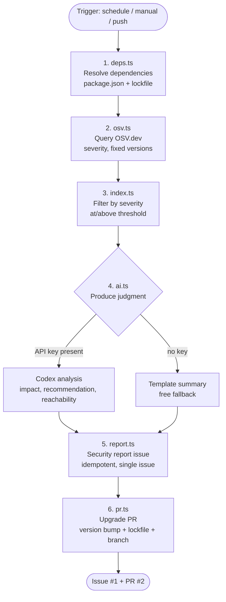
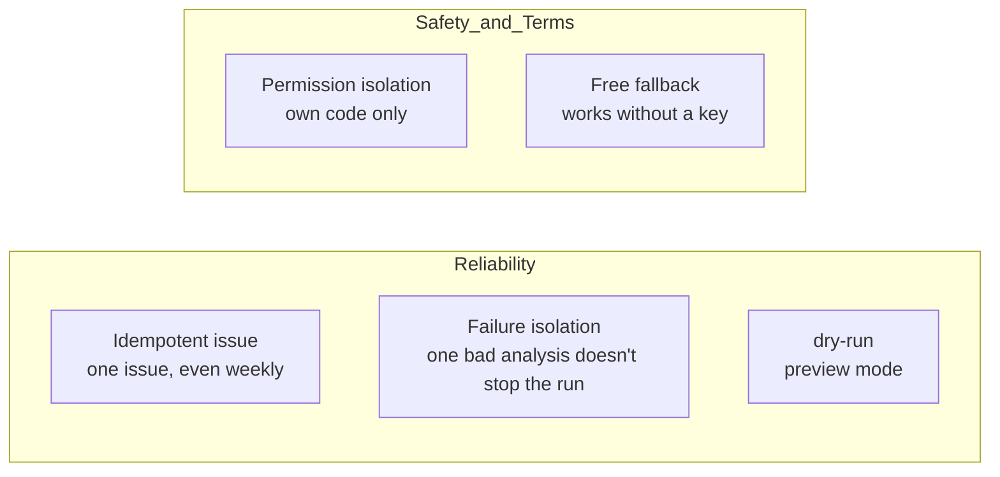
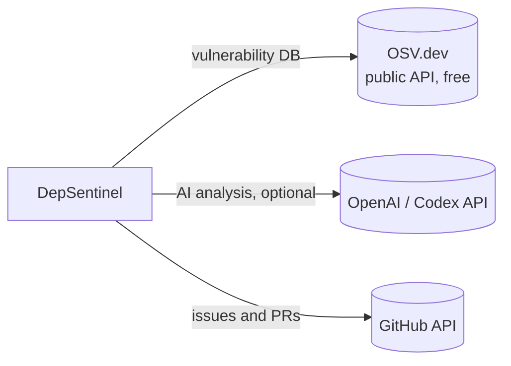

# DepSentinel — Architecture

> A one-glance view of the system. GitHub renders ```mermaid``` blocks automatically.

## Pipeline (end-to-end)



## Component responsibilities

| Module | Role | Input → Output |
|---|---|---|
| `deps.ts` | Resolve dependencies | `package.json`/`lock` → `{name, version}[]` |
| `osv.ts` | Query vulnerabilities | deps → `Advisory[]` (severity, fixedVersions) |
| `ai.ts` | Produce judgment | advisory → `{impact, recommendation, reachability}` |
| `version.ts` | semver comparison | fixedVersions → best target version |
| `report.ts` | Write the issue | findings → GitHub Issue (idempotent) |
| `pr.ts` | Open the PR | upgrades → branch + commit + PR |
| `index.ts` | Orchestration | inputs → coordinates all of the above |

## Core design principles



- **Idempotency:** a hidden marker + label let it find and update the existing issue → zero noise
- **Permission isolation:** runs on the installing repo's own code only (never scans others' code)
- **Free fallback:** with no OpenAI key, it builds template summaries from OSV data → issue/PR still work
- **Safety net:** passing the test suite after an upgrade is the recommended merge gate

## External dependencies



- **OSV.dev** — required, free, no key
- **OpenAI/Codex** — optional (for AI explanations)
- **GitHub** — issue/PR creation (workflow `GITHUB_TOKEN`)
